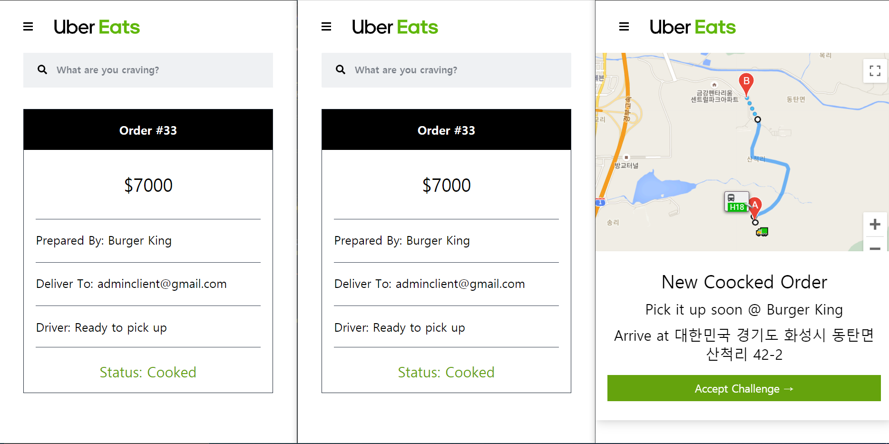
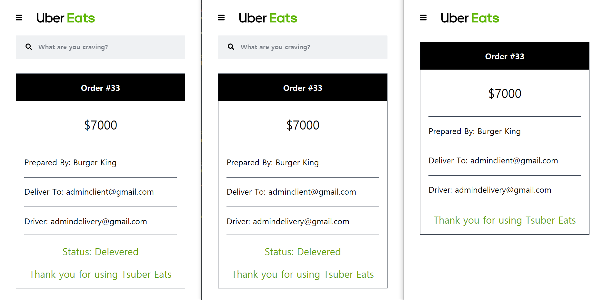
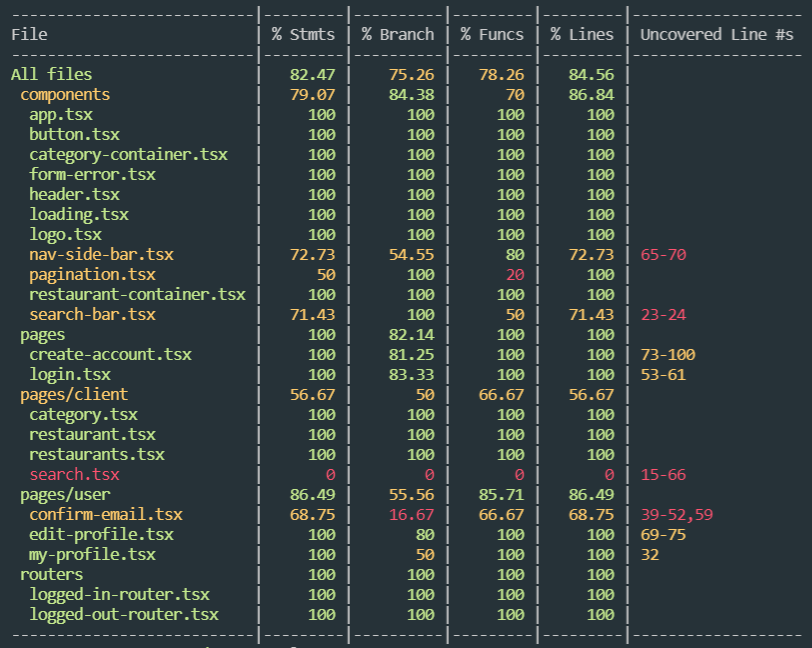

# Tsuber Eats Frontend

The Frontend of Tsuber Eats<br>

[👉 The Backend of Tsuber Eats](https://github.com/ShigatsuEl/tsuber-eats-backend)<br>

### Description

Cloning User Eats by Using React, TypeScript and GraphQL Apollo<br>

\+ Testing with React Testing Library(Unit Test) and Cypress(E2E Test)<br>

### Demo

[Tsuber Eats](https://tsuber-eats.netlify.app/)<br>

### Preview

<br>

<br>

### Technology Stack

| Frontend |      Technology       |  Description   |
| :------: | :-------------------: | :------------: |
|    01    |         React         |      CRA       |
|    02    |      TypeScript       |    Add Type    |
|    02    |      TailwindCSS      | Styling Method |
|    03    |    GraphQL Apollo     |   Pull Data    |
|    04    | React Testing Library |   Unit Test    |
|    05    |        Cypress        |    E2E Test    |

| Backend |  Technology  |   Description   |
| :-----: | :----------: | :-------------: |
|   01    |    NestJS    | Node Framework  |
|   02    |   GraphQL    |    Resolver     |
|   03    |  TypeScript  |    Add Type     |
|   04    |   TypeORM    |    Database     |
|   05    | JsonWebToken | Authentication  |
|   06    |   Mailgun    |  Mail Service   |
|   07    |     Jest     | Unit / E2E TEST |

### Directory Structure

```
coverage
cypress
node_modules
public
src
|-- __generated__
|-- components
|-- hooks
|-- images
|-- pages
|   |-- client
|   |-- driver
|   |-- owner
|   |-- user
|-- routers
|-- styles
...
```

### Project Screen Function

- User
  - Home
    - 로그인 | 로그아웃 라우터 분리
  - Show
    - User 정보확인
  - Edit
    - User 정보수정
    - Navigation Geolocation을 사용해 유저 위치 업데이트
- Client
  - Home
    - Restaurants 리스트 보기
  - Restaurant
    - Menu 리스트 보기
    - Order 생성하기
  - Order
    - 실시간 Order Status 확인하기
- Owner
  - Home
    - Owner Restaurants 리스트 보기
  - Restaurant
    - Menu 리스트 보기
    - Victory 라이브러리를 사용한 매출표 보기
  - Menu
    - Menu 생성 | 수정 | 삭제하기
  - Order
    - 실시간 Order Status 확인하기
    - Client 측에서 Order 생성 시, Order 페이지로 리다이렉트
- Driver
  - Home
    - Order Dashboard 보기
    - Owner 측에서 Menu 준비 완료 시, Google Map API를 활용한 라우팅 보여지기
  - Order
    - 실시간 Order Status 확인하기
    - Order 파트 마무리하기

### Project Purpose

본 프로젝트는 아래의 몇가지 이유를 충족시키기 위해 클론코딩한 것 입니다.<br>

- TypeScript를 적는 방식에 익숙해지고 JavaScript에 Type을 곁들이면 왜 좋은지 느껴보기
- GraphQL을 완전히 사용해보고 REST API와 어떤 차이점이 있는지 생각해보기
- 백엔드 스택으로 NodeJS와 NestJS 중 무엇이 나에게 알맞은지 경험하기
- 테스트 코드 작성을 해봄으로써 안정된 프로젝트 빌드

### Memoir

- JavaScript vs TypeScript

  이번 프로젝트에서 처음으로 타입스크립트를 전부 적용해봤는데 개인적인 생각으로는 타입스크립트 빌드 경험이 매우 좋았다고 느껴집니다.

  타입을 추론하거나 타입을 직접 작성하는 일은 때때로 시간이 많이 걸리는 경우도 있었으나 타입을 적고난 후, VSC에서 지원하는 auto complete를 사용하게 되면서 타입이 존재한다는 것을 바로바로 확인할 수 있었고 그 덕분에 중요한 작업들이 에러를 거치지 않고 바로바로 실행되는 경험을 할 수가 있었습니다.

  자바스크립트를 사용했을 때는 절대 불가능한 일이었다. 코드를 작성할 때 분명히 어딘가에 실수를 유발해 에러를 발생시키고 가끔은 어디서 발생한 에러인지 알기 어려울 때도 존재한 적도 있기 때문입니다.

  이러한 에러를 해결하려고 노력하는 시간에 비해 타입을 적는 일은 절반도 채 되지 않기 때문에 타입을 사용하는 것이 반드시 시간을 낭비하는 일만은 아닌 것 같다.

  앞으로 전자와 후자 중 무엇을 선택할 것인지 따져본다면 특별한 이유가 없다고 가정했을 때 후자를 택할 것 같습니다.

- GraphQL vs REST API

  GraphQL을 사용해보면서 서버에 모든 데이터를 요청하지 않고 자신의 상황에 맞춰 원하는 필드들만 요청할 수 있다는 것이 사용자 경험을 더 좋게 만들어 줄 것이라고 생각했습니다.

  하지만 실제로 더 좋았던 부분은 Apollo Client Cache를 적극 활용했을 때 입니다.

  Apollo는 백엔드로 데이터를 요청하기 전에 Cache에 데이터가 존재하는지 먼저 확인하게 되는데 이 점을 이용해 API 요청 횟수를 줄이는 방법을 사용했습니다.

  Mutation이 발생한 후 refetchQueries 메서드를 사용해 query 요청을 다시 한 번 하지않고 cache data를 직접 수정하여 data를 변경해주는 시도를 했는데 결과적으로 매우 빠른 상호작용을 보여줬습니다.

  이는 GraphQL에서 발견한 가장 멋진 부분이라고 생각합니다.

- NodeJS vs NestJS

  NestJS는 NodeJS와 다르게 구조를 가지고 있습니다.

  NodeJS에서는 어디에 어떤 파일을 위치하여도 상관이 없지만 NestJS에서는 모든 것이 Moudle로 이루어지며 이는 캡슐화를 통해 철저히 분리하는 작업을 합니다.

  그렇다고 서로 사용할 수 없는 것은 아니고 의존성을 주입함으로써 연결할 수 있으며 이로 인해 분리화가 이루어져도 서로 연결되어 있는 느낌을 받습니다.

  이것은 굉장히 튼튼한 구조를 가지게 하며 NodeJS에서는 찾아볼 수 없는 멋진 장점 중 하나라고 생각합니다.

  또는 TypeScript 기반으로 된 NestJS를 사용하면서 안정된 코드 작성을 할 수 있는 점도 있는 것 같습니다.

  그 외에 DTO -> Resolver -> Service 패턴으로 반복적인 작업을 하면서 굉장히 빠르게 백엔드를 구축할 수 있는 것과 데코레이터와 모듈을 동적으로 생성해 다양하게 활용할 수 있는 것도 NestJS만의 멋진 이유인 듯 합니다.

  개인적으로는 자유분방한 느낌을 주는 NodeJS보다 일정한 규칙과 패턴을 가진 NestJS가 굉장히 매력적으로 다가왔습니다.

- Testing

  <br>

  Unit Test | E2E Test 모두 진행해 보았고 위와 같이 모든 컴포넌트를 테스팅 해봤습니다.

  개인적으로 Unit Test보다는 E2E Test에서 필요성을 느꼈는데 특히 Cypress를 사용해 Front Part를 테스트하면서 오류를 검출한 경험이 있어 Test의 필요성을 느끼게 되었다.

  최근에는 StoryBook이라는 library에 대해서도 알게 되었는데 비지니스 로직을 제외하고 UI 부분을 테스트하면서 Cypress도 같이 사용해보면 좋겠다는 생각이 들었다.

### Code Challenge

- Restaurant Hook을 만들어 Page 별도의 Pagination 구현
- Create Dish 기능에서 Dish Option 중 Sub Option 구현
- Edit Dish 구현
- User Location Field 추가
- Edit User Page에서 Navigator Location을 사용해 사용자 위치정보 업데이트
- Driver와 Customer 간, latitude | longitude 비교 후 Google Map에 Route 표시하기

### Move Forward

- Gatsby를 사용해 정적 블로그 및 포트폴리오 빌드
- NestJS와 React를 사용해 개인 프로젝트(마피아 게임) 빌드
